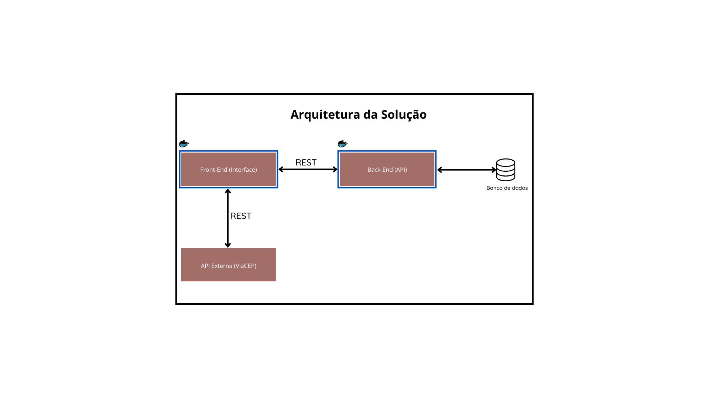

# VestSoft - Aplicação para Loja de Roupas

Uma interface desenvolvida em HTML 5, JavaScript e CSS que gerencia o cadastramento de produtos, controle de estoque e registro de vendas de uma loja de roupas. O projeto tem como objetivo oferecer uma solução prática e eficiente para a administração de pequenos comércios.

---

## Funcionalidades

- **Cadastro de Produtos:** Adiciona e gerencia informações de produtos.
- **Controle de Estoque:** Monitora a quantidade de itens disponíveis.
- **Registro de Vendas:** Processa e armazena informações das vendas realizadas.
- **Busca de Cep:** Busca de CEP para retornar um endereço de entrega através da api ViaCEP.
  \\n*Endpoint Utilizado:* GET - viacep.com.br/ws/<CEP>/json/
  \\n*API Gratuita:* A API é pública e não há necessedidade de cadastro prévio para sua utilização.

## Diagrama da solução



## Pré-requisitos

- **Navegador Web** instalado.

---

## Instalação

Para configurar o ambiente de desenvolvimento e instalar as dependências do projeto, siga os passos abaixo:

1. **Clone o Repositório:**

   ```bash
   git clone https://github.com/leandromunizdev/mvppucrio-frontend.git
   cd nome-do-repositorio

   ```

2. No arquivo index.js altere a const API_BASE_URL com a url da api em execução, por exemplo:
   "http://localhost:5000".

---

# Execução

## Executando localmente

1. Abra o arquivo index.html no seu navegador de preferência.

## Executando via Docker

### Utilizando o Dockerfile

1. Construa a imagem Docker:

   ```bash
   docker build -t vestsoft-app .
   ```

2. Execute o container:
   ```bash
   docker run -p 80:80 vestsoft-app
   ```
3. A aplicação estará disponível na seguinte URL:

   ```
   http://localhost ou http://localhost:<PORTA>
   ```

### Utilizando o docker-compose-yml

1. Construa e inicie os serviços:

   ```bash
   docker-compose up --build
   ```

2. A aplicação estará disponível na seguinte URL:

   ```
   http://localhost ou http://localhost:<PORTA>
   ```

---

# Licença

Este projeto é distribuído sob a licença MIT.
